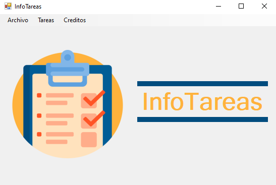

# Sobre la aplicación (En construcción)
InfoTareas se crea con la necesidad de una aplicación personal que notifique las tareas pendientes que hay en el transcurso de la semana. Para ello se plantea las funcionalidades de separar las tareas en cursos y tiempo de entrega.

# Vista principal
Se plantea una vista principal simple para que la accesibilidad de la aplicación sea lo más optima posible.

    

# Creditos
 - Felipe Londoño (Desarrollador)
 - flaticon.es (Plataforma de imagenes libres)
